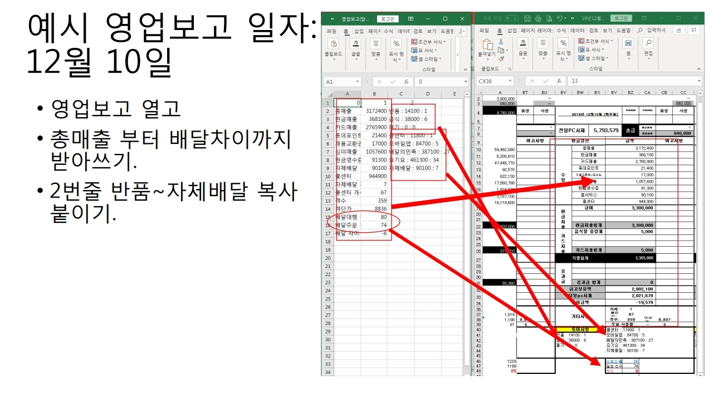

Extracts data from excel files downladed from headquarter's ERP database,

manipulates data to form processed data for daily report

README for my staff was written in Korean,

please check for flow of directions!

